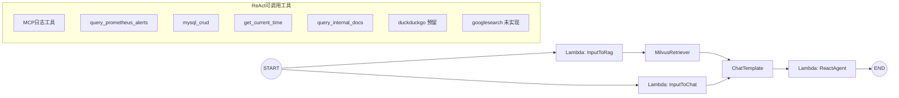

# 对话 Agent 全流程详解

> [!summary]
> 本文从可执行入口 `internal/ai/cmd/chat_cmd/main.go` 出发，完整拆解对话 Agent 的组件与执行过程：`START`、`Lambda`、`Milvus`、`OpenAI`、`ChatTemplate`、`ReAct`、`Tool`、`DuckDuckGo`、`GoogleSearch`、`END`，并结合实际输入 `你好` 与 `现在是几点` 还原一次真实对话事件链路。

## 1. 入口与 runnable 执行器

`internal/ai/cmd/chat_cmd/main.go` 做了 3 件核心事：

1. 构造 `UserMessage`（包含 `ID`、`Query`、`History`）。
2. 调用 `chat_pipeline.BuildChatAgent(ctx)` 编译图，拿到 runnable 执行器。
3. 调用 `runner.Invoke(ctx, userMessage)` 执行对话，并把问答写入记忆窗口（`utility/mem/mem.go`）。

该文件里给了两次真实输入：

- 第 1 轮：`你好`
- 第 2 轮：`现在是几点`

因此它不是“伪流程”，而是可以直接运行的真实事件脚本。

---

## 2. 图编排（START -> ... -> END）

Agent 图定义在 `internal/ai/agent/chat_pipeline/orchestration.go`。



> [!info]
> 图采用 `AllPredecessor` 触发模式：`ChatTemplate` 必须等 `InputToChat` 和 `MilvusRetriever` 都完成才会执行，因此能稳定拿到“用户输入 + 历史 + 日期 + 文档召回”。

---

## 3. 组件逐个讲清楚

## 3.1 START

- 不是业务节点，而是编排图入口。
- 在本项目中，`START` 分两条并行路径：
  - 到 `InputToRag`（走检索链）
  - 到 `InputToChat`（走提示词链）

## 3.2 Lambda（InputToRag）

位置：`internal/ai/agent/chat_pipeline/lambda_func.go`

- `newInputToRagLambda` 只做一件事：返回 `input.Query`。
- 输出会直接进入 `MilvusRetriever` 作为检索 query。

## 3.3 MilvusRetriever（含 query embedding）

入口位置：`internal/ai/agent/chat_pipeline/retriever.go` -> `internal/ai/retriever/retriever.go`

执行细节：

1. 创建 Milvus 客户端（`utility/client/client.go`）。
2. 创建 Embedding 模型（`internal/ai/embedder/embedder.go`，Doubao Embedding）。
3. 检索时先对用户 query 做向量化（`EmbedStrings([]string{query})`）。
4. 用向量在 Milvus `agent.biz` 中搜索，`TopK=1`。
5. 返回 `id/content/metadata` 作为 `documents` 注入后续 `ChatTemplate`。

> [!warning]
> 当前是“向量召回 + TopK 截断”，没有单独 reranker 节点。

> [!tip]
> 代码里还做了容错包装：当 Milvus 返回 `extra output fields ... does not dynamic field` 这类已知错误时，降级为空文档而不是整条对话失败。

## 3.4 Lambda（InputToChat）

位置：`internal/ai/agent/chat_pipeline/lambda_func.go`

- `newInputToChatLambda` 生成模板变量 map：
  - `content`: 当前用户问题
  - `history`: 会话历史
  - `date`: 当前时间字符串

## 3.5 ChatTemplate

位置：`internal/ai/agent/chat_pipeline/prompt.go`

模板结构：

1. `SystemMessage(systemPrompt)`
2. `MessagesPlaceholder("history")`
3. `UserMessage("{content}")`

`systemPrompt` 中显式包含：

- 当前日期：`{date}`
- 相关文档：`{documents}`

这一步就是“构建带上下文（召回内容）的 prompt”。

## 3.6 OpenAI（ToolCallingChatModel）

位置：`internal/ai/agent/chat_pipeline/model.go` -> `internal/ai/models/open_ai.go`

- 使用 `OpenAIForDeepSeekV3Quick(ctx)`。
- 从配置读取 `model/api_key/base_url`（`ds_quick_chat_model.*`）。
- 返回 `model.ToolCallingChatModel`，用于 function call / tool call。

## 3.7 ReAct（你提到的 reat）

位置：`internal/ai/agent/chat_pipeline/flow.go`

- `newReactAgentLambda` 构建 `react.AgentConfig`：
  - `MaxStep = 25`
  - `ToolReturnDirectly = 空`
  - `ToolCallingModel = OpenAI 模型`
- 然后用 `compose.AnyLambda(ins.Generate, ins.Stream, nil, nil)` 包装成图节点 `ReactAgent`。

ReAct 的实际循环逻辑可以抽象为：

```text
输入消息 -> 调用模型
如果模型输出 tool_calls:
    执行工具
    工具结果回填为 tool message
    继续下一轮模型调用
否则:
    输出最终答案并结束
```

## 3.8 Tool（function call 执行层）

当前接入工具（`flow.go`）：

1. `GetLogMcpTool()`：日志 MCP 工具集
2. `query_prometheus_alerts`
3. `mysql_crud`
4. `get_current_time`
5. `query_internal_docs`（内部文档检索，底层仍走 Milvus）

function call 典型形态：

- 模型先输出 `tool_calls`
- 框架执行对应工具
- 工具结果（字符串/JSON）作为 tool message 回灌给模型
- 模型继续生成最终自然语言答案

## 3.9 DuckDuckGo

位置：`internal/ai/agent/chat_pipeline/tools_node.go`

- 已有 `newSearchTool()`，基于 `duckduckgo.NewTextSearchTool`。
- 但在 `flow.go` 里调用被注释掉了（`searchTool` 相关代码未启用）。
- 结论：**组件存在，当前对话主链未接入**。

## 3.10 GoogleSearch

- 仓库中没有 `googlesearch` 工具实现，也没有在 chat pipeline 中注册。
- 结论：**当前版本未实现 GoogleSearch 组件**。

## 3.11 END

- `ReactAgent` 输出 `*schema.Message` 后，图到达 `END`。
- 同步模式：返回 `res.answer`。
- 流式模式：逐 chunk 通过 SSE `event: message` 发送，最后 `event: done`。

---

## 4. 从“用户输入 -> embedding -> 召回 -> prompt -> ReAct -> function call -> 输出”看完整链路

## 4.1 前置：知识入库（否则召回为空）

虽然用户提问时会做 query embedding，但要召回到内容，库里必须先有向量数据。入库路径：

- 批量：`internal/ai/cmd/knowledge_cmd/main.go`
- 上传即入库：`internal/controller/chat/chat_v1_file_upload.go`

索引图是：`FileLoader -> MarkdownSplitter -> MilvusIndexer`，其中 `MilvusIndexer` 内部会对文档分片做 embedding 并写入 Milvus。

## 4.2 在线对话主链（每次提问都会走）

1. 用户输入进入 `UserMessage.Query`
2. `InputToRag` 输出 query
3. `MilvusRetriever` 对 query 做 embedding 后向量检索
4. 召回文档以 `documents` 注入 `ChatTemplate`
5. `InputToChat` 同时提供 `history/date/content`
6. `ChatTemplate` 组装完整消息列表
7. `ReactAgent` 驱动多轮推理与工具调用
8. 无工具调用时直接回答；有工具调用则进入 function call 循环
9. 最终答案输出并写回记忆窗口

---

## 5. 结合真实输入的事件回放（`chat_cmd/main.go`）

## 5.1 第 1 轮：`Q=你好`

事件顺序：

1. `History` 初始为空。
2. `InputToRag` 产出 query=`你好`。
3. `MilvusRetriever` 对“你好”做 embedding 并检索（`TopK=1`）。
4. `InputToChat` 产出 `{content:"你好", history:[], date:当前时间}`。
5. `ChatTemplate` 生成最终输入消息。
6. `ReactAgent` 调用模型：
   - 若无需工具，直接输出寒暄类回答；
   - 若模型决定查工具，则走 function call 后再给最终答复。
7. 程序把本轮 `用户消息 + 助手回答` 写入内存。

## 5.2 第 2 轮：`Q=现在是几点`

事件顺序：

1. `History` 已包含上一轮问答。
2. 同样经过检索与模板组装。
3. ReAct 常见路径是触发 `get_current_time` function call：
   - 工具返回 JSON（秒/毫秒/微秒/格式化时间）。
   - 模型基于工具结果生成自然语言时间回答。
4. 输出答案后，再次写入记忆窗口。

> [!example]
> 该轮的典型 function call 语义是：
> “我需要精确当前时间 -> 调用 `get_current_time` -> 读取工具返回 -> 组织成对用户可读的最终回答”。

---

## 6. 多轮记忆与输出形态

## 6.1 记忆窗口

位置：`utility/mem/mem.go`

- 按 `id` 维护会话记忆。
- `MaxWindowSize = 6`。
- 超限时按“成对问答”裁剪，避免只留单边消息导致上下文错位。

## 6.2 输出

- `/api/chat`：一次性返回答案。
- `/api/chat_stream`：SSE 分块返回。
  - `event: connected`
  - `event: message`（多次）
  - `event: done`

---

## 7. 关键结论（面向实现）

1. 这个 chat agent 是“图编排 + RAG + ReAct + function call”的组合架构。
2. 用户 query 的 embedding 在 `MilvusRetriever` 内部实时完成，不是独立节点。
3. Prompt 上下文来自四部分：`history + content + date + documents`。
4. ReAct 通过多轮工具调用把外部能力（时间、日志、知识库等）纳入回答。
5. DuckDuckGo 当前是“已写未接”，GoogleSearch 当前是“未实现”。

> [!todo]
> 若你希望我下一步继续，我可以再补一版“时序图 + 回调日志字段对照表”，直接对应到 `log_call_back.LogCallback` 的 `OnStart/OnEnd` 输出格式，便于你在线上排查每一轮 tool call。
