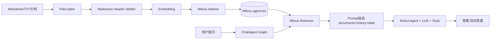
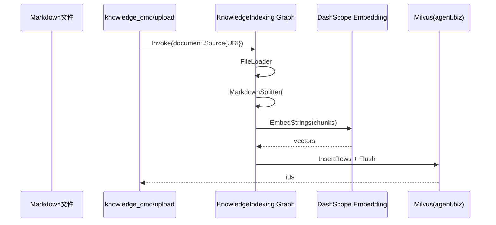
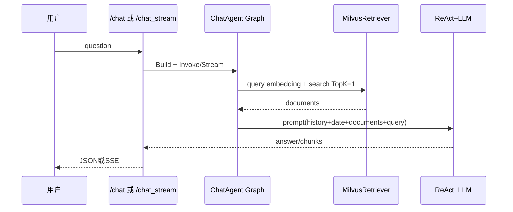

# 知识库 Agent 全流程实现梳理

> [!summary]
> 本文从你指定的入口 `internal/ai/cmd/knowledge_cmd/main.go` 出发，完整梳理「提问前数据准备（加载、分片、向量化、索引）」与「提问后回答生成（召回、排序/重排、生成、流式返回）」全链路，并细化到关键函数与其内部调用。

## 1. 总体架构（两条主链路）

- 离线/半离线建库链路：`internal/ai/cmd/knowledge_cmd/main.go`（批量） + `internal/controller/chat/chat_v1_file_upload.go`（在线上传后增量入库）
- 在线问答链路：`/api/chat` 与 `/api/chat_stream` → `internal/ai/agent/chat_pipeline/*`
- 向量库：Milvus，库名 `agent`，集合名 `biz`（`utility/common/common.go`）

---

## 2. 入口与运行时装配

### 2.1 服务入口（HTTP）

- `main.go`
  - 从配置读取 `file_dir` 并写入 `common.FileDir`
  - 注册 `/api` 路由，绑定 `chat.NewV1()`
  - 对外端口 `6872`

### 2.2 API 入口（对知识库链路有影响）

- `POST /api/upload`：`internal/controller/chat/chat_v1_file_upload.go` 
  - 保存文件到 `common.FileDir`
  - 调用 `buildIntoIndex(ctx, path)` 执行入库
- `POST /api/chat`：`internal/controller/chat/chat_v1_chat.go`
  - 同步返回回答
- `POST /api/chat_stream`：`internal/controller/chat/chat_v1_chat_stream.go`
  - 流式返回回答（SSE）

---

## 3. 提问前链路：数据准备（加载、分片、索引）

## 3.1 批量建库入口：`internal/ai/cmd/knowledge_cmd/main.go`

核心流程（`main()`）：

1. `BuildKnowledgeIndexing(ctx)` 编译索引图（返回 runnable）
2. `filepath.WalkDir("./docs")` 遍历文档目录
3. 仅处理 `.md` 文件
4. 对每个文件先做“同源去重”（按 `metadata._source`）
5. `r.Invoke(ctx, document.Source{URI: path})` 触发索引图

### 3.1.1 同源去重逻辑（非常关键）

在每个文件入库前：

- `loader.NewFileLoader(ctx)` + `loader.Load(...)` 读出文档 metadata
- 构造表达式：`metadata["_source"] == "..."`
- 查询老数据：`cli.Query(..., []string{"id"})`
- 拼接 `id in ["..."]` 并执行 `cli.Delete(...)`

目的：同一文件重复导入时，先删旧切片，再写新切片，避免知识重复和污染。

## 3.2 索引图定义：`internal/ai/agent/knowledge_index_pipeline/orchestration.go`

`BuildKnowledgeIndexing(ctx)` 的图节点：

- `FileLoader`（`newLoader`）
- `MarkdownSplitter`（`newDocumentTransformer`）
- `MilvusIndexer`（`newIndexer`）

边关系：`START -> FileLoader -> MarkdownSplitter -> MilvusIndexer -> END`

## 3.3 各节点内部函数

### 3.3.1 Loader：`newLoader`

- 文件：`internal/ai/agent/knowledge_index_pipeline/loader.go`
- 实现：`file.NewFileLoader(ctx, &file.FileLoaderConfig{})`
- 作用：把 `document.Source{URI: path}` 加载成文档对象（含 content + metadata）

### 3.3.2 分片：`newDocumentTransformer`

- 文件：`internal/ai/agent/knowledge_index_pipeline/transformer.go`
- 使用：`markdown.NewHeaderSplitter`
- 配置关键点：
  - `Headers: {"#": "title"}`：按一级标题语义切分
  - `TrimHeaders: false`：分片内容保留标题
  - `IDGenerator`: `uuid.New().String()`：每个分片独立 ID

### 3.3.3 索引：`newIndexer -> NewMilvusIndexer`

- `internal/ai/agent/knowledge_index_pipeline/indexer.go`
- 实际实现：`internal/ai/indexer/indexer.go`

`NewMilvusIndexer(ctx)` 内部做了三件事：

1. `client.NewMilvusClient(ctx)`：拿到 Milvus 客户端并确保库表可用
2. `embedder.DoubaoEmbedding(ctx)`：构造 embedding 模型
3. `milvus.NewIndexer(ctx, &milvus.IndexerConfig{...})`：组装索引器

字段 schema（`internal/ai/indexer/indexer.go`）：

- `id`：主键字符串
- `vector`：`BinaryVector`，`dim=65536`
- `content`：文本
- `metadata`：JSON

> [!info]
> `embedder` 配置维度是 2048，而 Milvus 里是二进制向量 65536。这里依赖 Eino Milvus 组件将 float embedding 转为二进制字节后再入库，因此维度以 bit 计数（2048 * 32 = 65536）。

## 3.4 Milvus 初始化与加载：`utility/client/client.go`

`NewMilvusClient(ctx)` 关键步骤：

1. 连 `default` 库
2. 若不存在则创建 `agent` 库
3. 连 `agent` 库
4. 若不存在则创建 `biz` 集合 + 索引（`id/content/vector`）
5. **先 `ReleaseCollection` 再 `LoadCollection`，并显式 load 字段**
   - `id`, `vector`, `content`, `metadata`

这一步是你之前修复 `extra output fields [content metadata]...` 的关键点。

---

## 4. 提问后链路：回答生成（召回、排序/重排、生成）

## 4.1 请求入口

### 4.1.1 同步聊天

- `internal/controller/chat/chat_v1_chat.go`
  - 组装 `chat_pipeline.UserMessage{ID, Query, History}`
  - `chat_pipeline.BuildChatAgent(ctx)`
  - `runner.Invoke(...)`
  - 回写记忆：用户消息 + 模型回答（`utility/mem/mem.go`）

### 4.1.2 流式聊天

- `internal/controller/chat/chat_v1_chat_stream.go`
  - 建 SSE 客户端（`internal/logic/sse/sse.go`）
  - `runner.Stream(...)` 持续 `Recv()` chunk
  - 每个 chunk 通过 SSE `event: message` 推送前端
  - 收尾后写入记忆

## 4.2 ChatAgent 图：`internal/ai/agent/chat_pipeline/orchestration.go`

图节点：

- `InputToRag`：提取 query 字符串
- `MilvusRetriever`：知识召回
- `InputToChat`：组装 `{content, history, date}`
- `ChatTemplate`：把 documents/history/date 注入系统提示词
- `ReactAgent`：最终推理与工具调用

边关系（`AllPredecessor`）：

- `START -> InputToRag -> MilvusRetriever -> ChatTemplate -> ReactAgent -> END`
- `START -> InputToChat -> ChatTemplate`

即：**问题文本分两路并行准备**，在 `ChatTemplate` 汇合。

## 4.3 召回实现：`internal/ai/retriever/retriever.go`

`NewMilvusRetriever(ctx)` 内部：

1. `client.NewMilvusClient(ctx)`
2. `embedder.DoubaoEmbedding(ctx)`
3. `milvus.NewRetriever(ctx, config)`
   - `Collection: biz`
   - `VectorField: vector`
   - `OutputFields: id/content/metadata`
   - `TopK: 1`

### 4.3.1 容错包装（你这次新增）

- `tolerantRetriever.Retrieve(...)`
- 若命中特定错误：`extra output fields ... does not dynamic field`
  - 返回空文档切片 `[]`，避免整条 chat 失败
- 其它错误继续返回

## 4.4 排序/重排现状（按你要求单独说明）

> [!warning]
> 当前代码里**没有独立 reranker 组件**（没有 cross-encoder 或二次重排节点）。

当前“排序”由两层组成：

1. Milvus 向量搜索本身的相似度排序（metric：HAMMING）
2. `TopK=1` 直接截断为 1 条结果

所以严格说是“召回 + 截断”，不是“召回 + 显式重排”。

## 4.5 生成实现（LLM + Prompt + Tools）

### 4.5.1 Prompt 组装

- 文件：`internal/ai/agent/chat_pipeline/prompt.go`
- 模板结构：
  - `SystemMessage(systemPrompt)`
  - `MessagesPlaceholder("history")`
  - `UserMessage("{content}")`
- `systemPrompt` 中包含：当前时间 `{date}` + 相关文档 `{documents}`

### 4.5.2 模型构建

- `internal/ai/models/open_ai.go`
- `OpenAIForDeepSeekV3Quick(ctx)` 读取配置项：
  - `ds_quick_chat_model.model`
  - `ds_quick_chat_model.api_key`
  - `ds_quick_chat_model.base_url`

### 4.5.3 ReAct Agent 工具集

- 文件：`internal/ai/agent/chat_pipeline/flow.go`
- 工具包括：
  - MCP 日志工具（`GetLogMcpTool`）
  - Prometheus 告警工具
  - MySQL CRUD 工具
  - 当前时间工具
  - 内部文档检索工具（`query_internal_docs`，本质仍调 Milvus Retriever）

---

## 5. 在线上传增量建库链路（补充）

`internal/controller/chat/chat_v1_file_upload.go` 的 `buildIntoIndex(ctx, path)` 与批量 CLI 基本一致：

1. `BuildKnowledgeIndexing(ctx)`
2. 按 `_source` 查重并删除旧记录
3. `r.Invoke(...)` 写入新分片

所以你在前端上传文件后能立刻召回，是因为这条链路会直接完成“增量切分 + 向量入库 + 可检索”。

---

## 6. 会话记忆与输出封装

- 记忆：`utility/mem/mem.go`
  - 每个 `session id` 一个窗口记忆
  - `MaxWindowSize=6`，超长时按“成对消息”裁剪，保持问答配对
- 输出封装：`utility/middleware/middleware.go`
  - 统一 JSON 结构 `{message, data}`

---

## 7. 端到端时序图

### 7.1 入库时序（批量/上传共性）

### 7.2 问答时序（同步/流式共性）

---

## 8. 关键结论

1. 你的知识库 Agent 是一个标准的「Eino 图编排 + Milvus 向量检索 + ReAct 工具调用」架构。
2. 提问前链路已经包含：文件加载、标题分片、embedding、索引入库、同源去重。
3. 提问后链路已经包含：召回、Prompt 注入、LLM 生成、同步/流式返回、记忆回写。
4. 当前没有独立“重排器”；现状是 Milvus 排序 + TopK=1 截断。
5. 你这次的稳定性修复点在 Milvus 字段加载（Release + LoadFields）和检索兜底包装。
