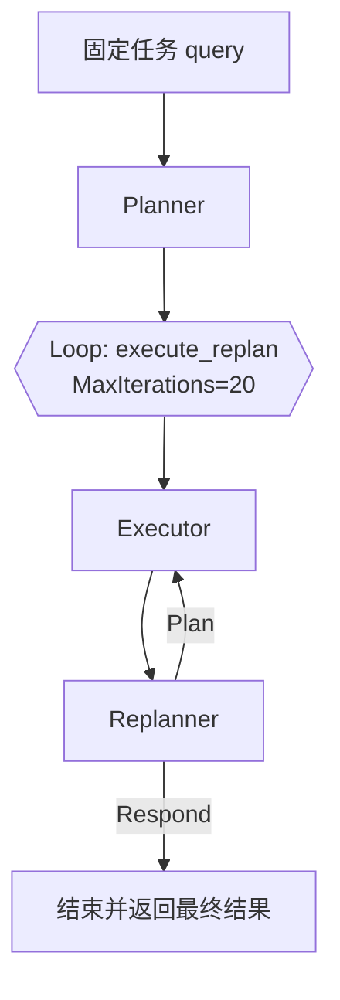
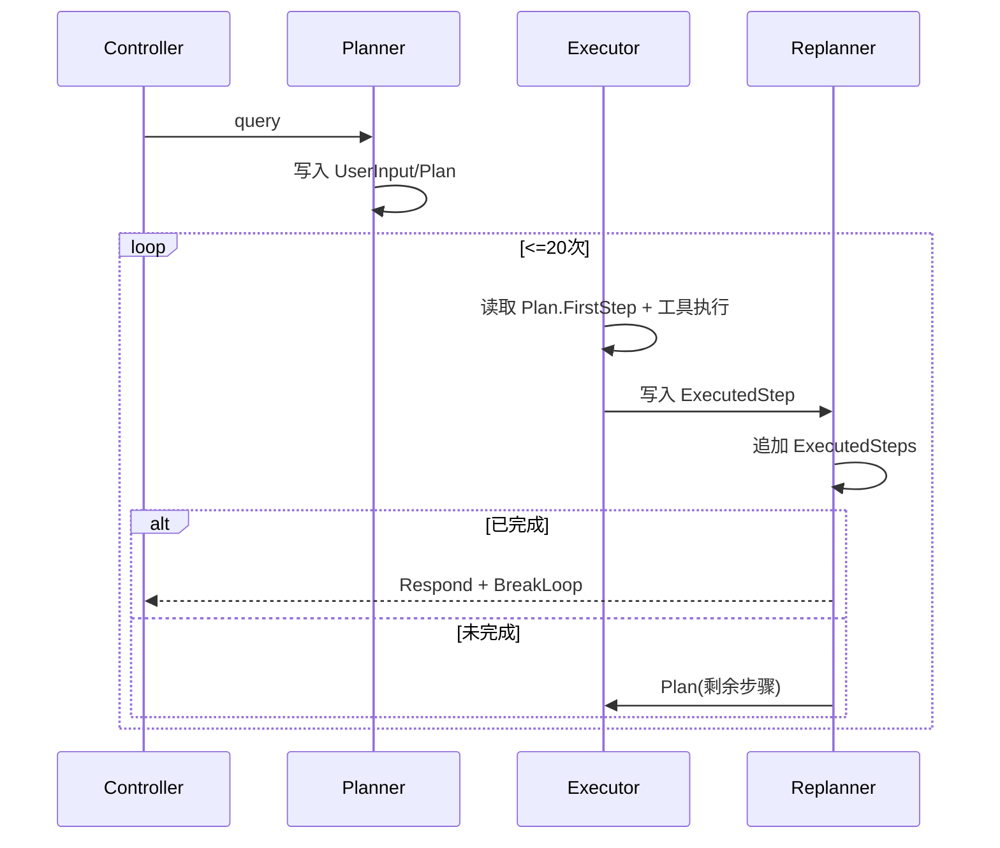

# 运维 Agent 全流程详解

> [!summary]
> 本文从接口入口 `internal/controller/chat/chat_v1_ai_ops.go` 出发，完整拆解运维 Agent 的执行链路：`Plan -> Execute -> Replan`。重点覆盖三大核心智能体协同机制、会话状态流转、工具系统（普通 Tool + MCP Tool）以及最终响应 `result/detail` 的形成方式。

## 1. 接口入口与请求路径

### 1.1 HTTP 入口

- 路由由 `main.go` 注册在 `/api` 分组下，运维接口是 `POST /api/ai_ops`。
- 接口定义在 `api/chat/v1/chat.go`：
  - `AIOpsReq` 无业务字段（空请求体）
  - `AIOpsRes` 返回 `result` 与 `detail`

### 1.2 控制器入口

`internal/controller/chat/chat_v1_ai_ops.go` 的核心行为：

1. 构造固定任务指令（不是用户动态输入），明确要求：
   - 先查 Prometheus 活跃告警
   - 再按告警名查内部文档
   - 涉及时间必须先查当前时间工具
   - 涉及日志必须走日志工具（带地域和日志主题）
   - 最终输出标准化“告警分析报告”格式
2. 调用 `plan_execute_replan.BuildPlanAgent(ctx, query)`。
3. 将结果写回：
   - `result`: 最终回答（最后一条消息内容）
   - `detail`: 过程消息列表（每个事件输出消息的快照）

> [!info]
> 这里的 `req` 虽然存在，但当前实现没有读取任何字段；即 AIOps 是“固定任务模板驱动”的执行流程。

---

## 2. 总体架构：Plan-Execute-Replan

`internal/ai/agent/plan_execute_replan/plan_execute_replan.go` 负责装配三智能体：

- Planner（规划）
- Executor（执行）
- Replanner（复盘重规划）

并通过 `planexecute.New(...)` 组合成单一 agent。

> [!tip]
> 这是“两层循环”结构：
> - 外层：`Executor <-> Replanner` 的循环（最多 20 次）
> - 内层：Executor 自身是一个带工具调用的 ReAct 循环（本项目配置为 999999 次上限）

---

## 3. 三个核心智能体协同原理（重点）

## 3.1 Planner：把目标拆成结构化步骤

实现：`internal/ai/agent/plan_execute_replan/planner.go`

- 模型：`OpenAIForDeepSeekV31Think`（偏推理型）
- 构造器：`planexecute.NewPlanner`
- 输出要求：强制以 `Plan` 工具调用形式给出 `{"steps": [...]}`

底层要点（来自 `github.com/cloudwego/eino/adk/prebuilt/planexecute`）：

- Planner 启动时把用户输入写入会话键 `UserInput`。
- 生成后把计划写入会话键 `Plan`。
- 计划结构默认是 `steps[]`，执行方只取 `FirstStep()`。

> [!note]
> 这意味着 Planner 不是一次性生成“最终答案”，而是先定义可执行路径，让后续 Executor 严格执行第一步并逐步推进。

## 3.2 Executor：只执行“当前第一步”，并可调用工具

实现：`internal/ai/agent/plan_execute_replan/executor.go`

- 模型：`OpenAIForDeepSeekV3Quick`（偏执行效率）
- 构造器：`planexecute.NewExecutor`
- Tool 集：`MCP日志工具 + Prometheus告警 + 内部文档检索 + 当前时间`
- `MaxIterations: 999999`（Executor 内部 ReAct 回路的上限）

协同机制关键点：

1. Executor 运行前，会从会话里取：
   - `Plan`
   - `UserInput`
   - `ExecutedSteps`（历史执行记录）
2. 拼装 Executor Prompt：
   - OBJECTIVE（原目标）
   - Given the following plan（完整计划）
   - COMPLETED STEPS & RESULTS（历史执行结果）
   - Your task is to execute the first step（只执行当前第一步）
3. 执行结果写入会话键 `ExecutedStep`。

> [!important]
> Executor 每轮只对“第一步”负责，不负责判断是否结束；是否收敛由 Replanner 决策。

## 3.3 Replanner：根据执行结果二选一（继续 or 结束）

实现：`internal/ai/agent/plan_execute_replan/replan.go`

- 模型：`OpenAIForDeepSeekV31Think`
- 构造器：`planexecute.NewReplanner`
- 绑定两个决策工具：
  - `Plan`：给出剩余计划（继续）
  - `Respond`：给出最终答案（结束）

Replanner 协同动作：

1. 读取 `ExecutedStep` + 当前 `Plan.FirstStep()`。
2. 追加一条执行记录到 `ExecutedSteps`（形成历史轨迹）。
3. 用 `ReplannerPrompt` 评估是否已达成目标：
   - 若调用 `Respond`：触发 `BreakLoopAction`，外层循环立即终止。
   - 若调用 `Plan`：更新会话中的 `Plan`，进入下一轮 Executor。

> [!warning]
> Replanner 必须工具调用（forced tool choice），不允许自由文本“模糊回答”。因此它在协议层就是一个严格的路由器：要么继续，要么收敛。

---

## 4. 状态流转（Session Keys）

Plan-Execute-Replan 的协同本质，是基于会话键值的状态机：

- `UserInput`：原始目标
- `Plan`：当前有效计划
- `ExecutedStep`：当前轮执行产物
- `ExecutedSteps`：累计执行历史

---

## 5. 工具系统全量说明（Tool + MCP）

## 5.1 Executor 中注册的工具集

来自 `internal/ai/agent/plan_execute_replan/executor.go`：

1. `GetLogMcpTool()` 返回的 MCP 工具集合（动态）
2. `query_prometheus_alerts`
3. `query_internal_docs`
4. `get_current_time`

> [!info]
> 与 Chat Agent 不同，Ops Executor 没有挂 `mysql_crud`；因此 AIOps 流程不直接做数据库 CRUD。

## 5.2 MCP 工具（日志能力）

实现：`internal/ai/tools/query_log.go`

流程：

1. 创建 SSE MCP Client：`client.NewSSEMCPClient(mcp_url)`
2. 启动连接：`cli.Start(ctx)`
3. 初始化 MCP 协议：`cli.Initialize(...)`
4. 把 MCP Server 暴露的工具转换为 Eino Tools：`e_mcp.GetTools(...)`

关键特征：

- **工具名是运行时动态获取**，代码里没有静态写死每个日志工具名。
- 当前 `mcp_url` 是硬编码字符串；`manifest/config/config.yaml` 中虽然有 `cls_mcp_url`，但此函数未读取该配置。

## 5.3 `query_prometheus_alerts`

实现：`internal/ai/tools/query_metrics_alerts.go`

设计目标：

- 查询 Prometheus `/api/v1/alerts`
- 输出简化告警：`alert_name/description/state/active_at/duration`
- 对同名 `alertname` 去重，只保留第一条

当前代码现状（非常关键）：

- `queryPrometheusAlerts()` 一开始直接 `return PrometheusAlertsResult{}, nil`
- 导致后续 HTTP 请求代码不可达
- 实际运行等价于“成功但告警列表为空（0条）”

> [!warning]
> 这会直接影响 AIOps 的可用性：Planner/Executor 会认为“当前无活跃告警”，从而无法触发真实告警分析链路。

## 5.4 `query_internal_docs`

实现：`internal/ai/tools/query_internal_docs.go`

能力：

- 输入 `query`
- 通过 `retriever.NewMilvusRetriever(ctx)` 做语义召回
- 返回检索文档 JSON

底层检索配置（`internal/ai/retriever/retriever.go`）：

- 向量库：Milvus `agent.biz`
- 输出字段：`id/content/metadata`
- `TopK = 1`
- 发生特定字段错误时容错降级为空文档

> [!note]
> `query_internal_docs` 函数中对错误使用 `log.Fatal`，异常会导致进程退出；这对线上服务是高风险行为。

## 5.5 `get_current_time`

实现：`internal/ai/tools/get_current_time.go`

返回 JSON 包含：

- `seconds`
- `milliseconds`
- `microseconds`
- `timestamp`
- `success/message`

该工具用于满足控制器任务模板中的时间约束：“涉及时间参数必须先取当前时间再换算”。

---

## 6. 内部文档知识来源与索引链路

`query_internal_docs` 的回答质量依赖知识库是否已建好。数据来源主要两条：

1. 批量建库：`internal/ai/cmd/knowledge_cmd/main.go`
2. 上传即入库：`internal/controller/chat/chat_v1_file_upload.go`

索引图：`FileLoader -> MarkdownSplitter -> MilvusIndexer`。

> [!tip]
> 如果运维手册未入库或向量库为空，即使 Plan/Execute/Replan 框架正常，最终报告也会缺乏“文档内处理方案”。

---

## 7. 结果如何组装为 `result + detail`

`BuildPlanAgent` 的事件迭代逻辑：

- 每次收到 `event.Output != nil` 时，提取 message
- 把 message 字符串追加到 `detail[]`
- 记录最后一条 message 的 `Content` 作为最终 `result`

因此：

- `result` = 最终收敛答案
- `detail` = 过程轨迹（包含规划、执行、复盘等阶段的消息快照）

---

## 8. 一次完整执行的“真实语义”

综合代码语义，AIOps 的一次调用可抽象为：

1. 先制定一份“告警分析计划”。
2. Executor 执行第一步：通常会先探测告警、查文档、查日志/时间。
3. Replanner 判断是否完成：
   - 若信息不足，改计划继续。
   - 若信息充分，生成最终报告并终止循环。
4. 控制器返回结构化结果给前端/调用方。

> [!example]
> 这套模式的核心优势是：当中间结果与预期不一致时，不必整条链路失败，而是通过 Replanner 在下一轮自动修正策略。

---

## 9. 当前实现中的关键约束与改进点

- `AIOpsReq` 为空：暂不支持用户自定义目标/过滤条件。
- Prometheus 工具当前被短路返回（0 告警）。
- MCP URL 硬编码，未走配置键 `cls_mcp_url`。
- 部分工具在错误分支使用 `log.Fatal`，会中断服务进程。
- `query_internal_docs` 为 `TopK=1`，召回覆盖面较窄。

> [!todo]
> 如果你希望，我下一步可以基于这份文档直接给出“可落地改造方案”：
> 1) 修复 Prometheus 查询短路；2) MCP URL 配置化；3) 工具错误处理改为可恢复；4) 为 AIOpsReq 增加可控输入（时间窗、服务名、地域）。
